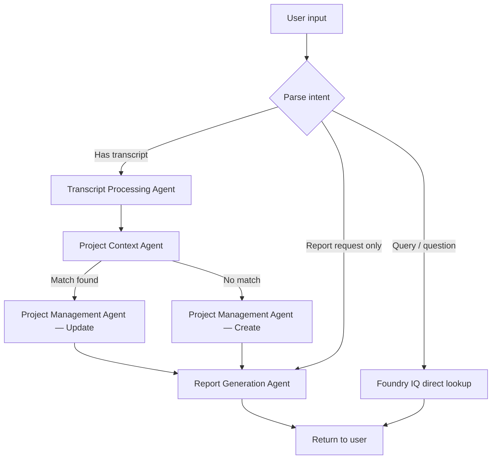
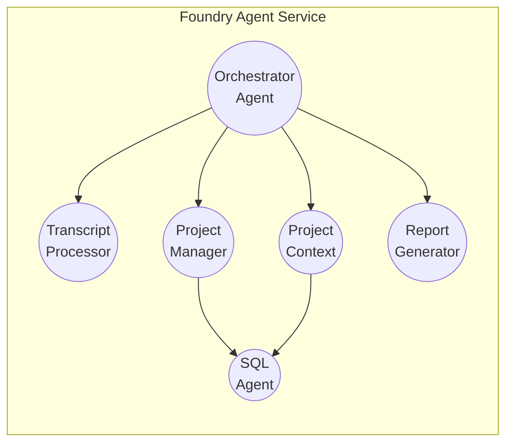

# Multi-Agent Design
{: .no_toc }

PM Buddy uses a coordinated team of specialized AI agents. Each agent owns a narrow, well-defined responsibility. The Orchestrator Agent routes work between them, combining their outputs into coherent results.

---

## Table of Contents
{: .no_toc .text-delta }

- TOC
{:toc}

---

## Why Multi-Agent?

A single monolithic agent tasked with "process transcript → update database → write report" quickly becomes fragile:

- **Context window pressure:** Squeezing SQL schemas, RAG results, PM templates, and report formats into one prompt degrades quality.
- **Tool conflict:** Function-calling LLMs perform better when each agent has a focused, small tool set.
- **Auditability:** Separate agents produce separate traces — it is easy to see exactly where a decision was made.
- **Independent scaling:** High-volume transcript ingestion and low-volume report generation have different resource profiles.

A multi-agent pattern also matches the natural cognitive division of work in a real project management team.

---

## Agent Framework

PM Buddy uses **Azure AI Foundry Agent Service** as the managed runtime, with **Semantic Kernel** (Python or .NET SDK) providing the planner, memory plugins, and function-calling infrastructure inside each agent.

| Framework Component | Role |
|---|---|
| Azure AI Foundry Agent Service | Managed agent thread lifecycle, tool execution, telemetry |
| Semantic Kernel Planner | Decomposes complex goals into sub-tasks for each agent |
| Semantic Kernel Plugins | Wrappers around SQL, Blob, Bing, and Foundry IQ tool calls |
| Azure AI Foundry Tracing | End-to-end observability across all agent hops |

---

## Agent Roster

### 1. Orchestrator Agent

**Purpose:** Entry point and traffic controller. Receives the raw user request, determines intent, delegates to specialist agents, and assembles the final response.

**System prompt excerpt:**
```
You are the Project Management Buddy orchestrator.
Given a user input (transcript or query), determine which of the following actions
is required: transcript_ingestion, project_lookup, project_create, project_update,
report_generation. Delegate each action to the appropriate specialist agent and
return a consolidated result to the user.
Always confirm the final project ID or creation status before generating reports.
```

**Tools available:**
- `call_agent(agent_name, payload)` — invoke any specialist agent
- `get_agent_result(run_id)` — retrieve async agent result

**Decision logic:**



---

### 2. Transcript Processing Agent

**Purpose:** Transforms raw, unstructured meeting transcript text into a clean, structured JSON entity object consumed by downstream agents.

**System prompt excerpt:**
```
You are a meeting transcript analyst for a project management system.
Extract the following entities from the provided transcript text:
- project_name (string): canonical project name or codename
- stakeholders (list): [{name, role, organization}]
- action_items (list): [{description, owner, due_date, priority}]
- milestones (list): [{title, target_date}]
- risks (list): [{description, severity}]
- summary (string): 3-sentence executive summary
Return strictly valid JSON matching the ProjectEntities schema.
Do not invent information not present in the transcript.
```

**Tools available:**
- `document_intelligence_extract(blob_url)` — parse `.docx`, `.pdf`, `.vtt`
- `speech_to_text(audio_url)` — transcribe raw audio

**Output schema:**
```json
{
  "project_name": "Atlas Initiative",
  "stakeholders": [
    {"name": "Priya Sharma", "role": "PM", "organization": "Contoso"}
  ],
  "action_items": [
    {"description": "Finalize vendor SLA", "owner": "David Kim", "due_date": "2025-04-15", "priority": "high"}
  ],
  "milestones": [
    {"title": "Phase 1 go-live", "target_date": "2025-06-30"}
  ],
  "risks": [
    {"description": "Hardware delivery delay", "severity": "medium"}
  ],
  "summary": "The Atlas Initiative team aligned on Phase 1 scope. A vendor SLA must be finalized by April 15. Go-live remains targeted for June 30, pending hardware delivery."
}
```

---

### 3. Project Context Agent

**Purpose:** Determines whether a related project already exists by combining semantic search (Foundry IQ) with structured SQL queries. Returns a confidence-scored list of candidate projects.

**System prompt excerpt:**
```
You are a project lookup specialist. Given a structured entity object from a transcript,
search both the Foundry IQ knowledge base (semantic similarity) and the SQL project database
(structured entity match) to find existing projects that may be related.
Score each candidate from 0.0 to 1.0. Return candidates with score >= 0.6.
If no candidate exceeds 0.6, return an empty list.
```

**Tools available:**
- `foundry_iq_search(query, top_k)` — semantic + vector search over project knowledge base
- `sql_query(sql, params)` — parameterized read queries against Azure SQL

**Why SQL _and_ Foundry IQ?**

| Scenario | Best Tool |
|---|---|
| Transcript says "Atlas Initiative"; DB has "Atlas Initiative" | SQL exact match |
| Transcript says "the cloud migration project"; DB has "Project Nimbus (Azure lift-and-shift)" | Foundry IQ semantic match |
| Transcript names a person who owns multiple projects | SQL + Foundry IQ combined scoring |
| Searching previous meeting notes for context | Foundry IQ only |

{: .important }
> **SQL database agents add clear value over Foundry IQ alone.** Foundry IQ is optimized for unstructured, semantic retrieval. Azure SQL provides authoritative, transactional data — exact project IDs, budget figures, status codes, and relational joins — that RAG cannot reliably reproduce. Both are needed.

---

### 4. Project Management Agent

**Purpose:** Either creates a new project charter and plan, or merges new information into an existing project. This is the most prompt-intensive agent.

**System prompt excerpt:**
```
You are a senior project manager assistant. You will receive either:
(A) A new project entities object — create a complete project charter with milestones, tasks, and a RACI chart.
(B) An existing project record + new entities — identify what has changed and produce a set of SQL UPDATE operations and a change summary.

When creating milestones, follow standard PM phases: Initiation, Planning, Execution, Monitoring, Closure.
When generating tasks, assign owners from the stakeholder list. Flag risks immediately.
Output must include: project_charter (markdown), sql_operations (list), change_summary (string).
Use Bing Search if you need to benchmark timelines or technology choices against industry standards.
```

**Tools available:**
- `sql_agent_write(operations)` — delegates INSERT/UPDATE to SQL Agent
- `bing_search(query)` — web grounding for PM best practices and benchmarks
- `blob_write(content, filename)` — save artifacts to Azure Blob Storage

---

### 5. SQL Agent

**Purpose:** The only agent authorized to execute data-modification queries against Azure SQL. Acts as a gatekeeper to prevent prompt-injection attacks from reaching the database.

**System prompt excerpt:**
```
You are a database agent. You execute only parameterized SQL operations passed to you
from authorized agents (Project Management Agent, Project Context Agent).
You must validate that:
- All queries are parameterized (no string interpolation).
- The operation type matches the allowed list: SELECT, INSERT, UPDATE (no DELETE, DROP, ALTER).
- All project_id values reference existing records before UPDATE operations.
Return row counts and generated IDs for INSERT operations.
```

**Tools available:**
- `sql_execute(sql, params)` — executes against Azure SQL via managed identity

**Security controls:**
- SQL Agent uses a dedicated Azure SQL login with least-privilege permissions
- Allows `SELECT`, `INSERT`, `UPDATE` on PM schema tables only
- All queries are parameterized — no dynamic SQL construction from LLM output
- Query results are returned to calling agent only, never to the user directly

---

### 6. Report Generation Agent

**Purpose:** Assembles final outputs — meeting summaries, status reports, action item lists, RACI charts — from the consolidated project state.

**System prompt excerpt:**
```
You are a project reporting specialist. Generate clear, professional project management
documents in Markdown format. Include:
- Executive summary (3–5 sentences)
- Action items table (owner, due date, priority, status)
- Milestone progress bar (using percentage complete)
- Risk register excerpt (top 3 risks with mitigation)
- Next steps (numbered list)
Format for Microsoft Teams Adaptive Card rendering where possible.
```

**Tools available:**
- `blob_write(content, filename)` — save report to Blob Storage
- `teams_post(adaptive_card)` — post Adaptive Card to Teams channel
- `foundry_iq_search(query)` — retrieve relevant historical reports for consistent formatting

---

## Agent Communication Pattern

PM Buddy uses the **Orchestrator → Specialist** pattern (not peer-to-peer):



All inter-agent calls pass through the Orchestrator. Specialist agents do not call each other directly. This design:
- Keeps the call graph acyclic and easy to trace
- Lets the Orchestrator enforce ordering and retry logic
- Centralizes token budget management

---

## Prompt Security

| Risk | Mitigation |
|---|---|
| Prompt injection via transcript | Transcript content is passed as a **data** parameter, not injected into the system prompt |
| SQL injection via LLM output | SQL Agent uses parameterized queries; no raw LLM-generated SQL reaches the DB |
| Sensitive data in LLM context | PII is redacted by the Transcript Processing Agent before any OpenAI call |
| Runaway token consumption | Orchestrator enforces per-run max_tokens budget; Azure Monitor alerts on overrun |
