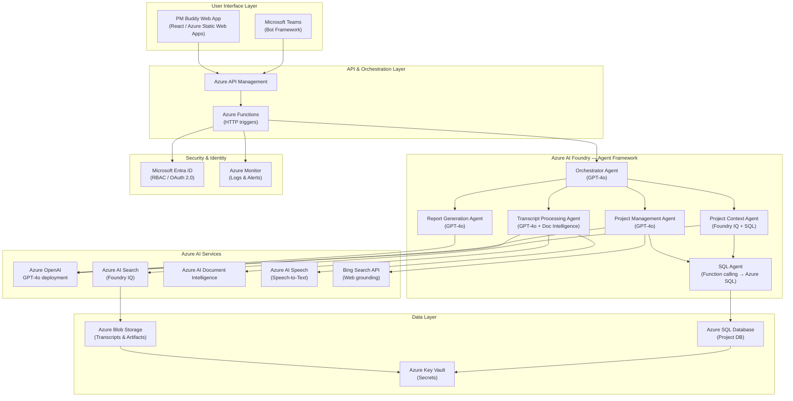

# System Architecture
{: .no_toc }

High-level architectural design for PM Buddy using Microsoft Azure AI Foundry and Azure AI Services.

---

## Table of Contents
{: .no_toc .text-delta }

- TOC
{:toc}

---

## Architecture Diagram



---

## Layers and Components

### User Interface Layer

PM Buddy is surfaced through two channels:

**Microsoft Teams Bot**
- Built with Azure Bot Framework SDK
- Users submit transcripts via chat command or Teams Meeting transcript auto-upload
- Bot posts summaries and reports directly into the conversation thread
- Leverages Teams Adaptive Cards for rich, interactive output

**PM Buddy Web Application**
- Single-page application (React) hosted on Azure Static Web Apps
- Provides a project dashboard, transcript upload, and report browser
- Authenticates users via Microsoft Entra ID (Azure AD)

---

### API & Orchestration Layer

**Azure API Management (APIM)**
- Single ingress point for all frontend requests
- Enforces OAuth 2.0 token validation (Entra ID)
- Rate limiting, caching, and request logging
- Routes requests to the appropriate Azure Function

**Azure Functions**
- Serverless compute triggered by HTTP, Queue, or Event Grid
- Functions include: `ingest-transcript`, `get-project`, `trigger-report`
- Calls into the Azure AI Foundry Agent Framework to initiate agent runs
- Stateless — agent state is managed by the Agent Framework runtime

---

### Azure AI Foundry — Agent Framework Layer

The core intelligence of PM Buddy lives here. Azure AI Foundry Agent Service provides a managed runtime for running multi-step, tool-using AI agents.

See [Multi-Agent Design]({{ site.baseurl }}/pmbuddy/agents/) for full agent definitions.

| Agent | Primary Responsibility |
|---|---|
| Orchestrator Agent | Parses intent, routes to specialist agents, merges results |
| Transcript Processing Agent | Extracts structured entities from raw transcripts |
| Project Context Agent | Finds related projects via Foundry IQ and SQL |
| Project Management Agent | Creates or updates project plans |
| Report Generation Agent | Produces reports and artifacts |
| SQL Agent | Executes parameterized queries against Azure SQL |

**Semantic Kernel** provides the agent communication infrastructure (planner, function calling, memory plugins) running inside each agent.

---

### Azure AI Services Layer

| Service | Role in PM Buddy |
|---|---|
| **Azure OpenAI — GPT-4o** | Core LLM for all agents. Reasoning, plan generation, summarization. |
| **Azure AI Search** | Vector store and semantic ranker for Foundry IQ (knowledge base). |
| **Azure AI Document Intelligence** | Parses `.docx`, `.pdf`, `.vtt` transcripts into structured text. |
| **Azure AI Speech** | Converts raw audio recordings to text transcripts. |
| **Bing Search API** | Grounds project plans with current web content (industry benchmarks, tech specs). |

---

### Data Layer

| Resource | Purpose |
|---|---|
| **Azure SQL Database** | Authoritative structured store for projects, milestones, tasks, owners, budgets |
| **Azure Blob Storage** | Raw transcripts, generated reports, indexed documents for Foundry IQ |
| **Azure Key Vault** | Stores connection strings, API keys, and managed identity credentials |

**Azure SQL Schema (high-level):**

```sql
Projects      (project_id, name, owner, start_date, status, budget, created_at, updated_at)
Milestones    (milestone_id, project_id, title, due_date, status)
Tasks         (task_id, milestone_id, description, assignee, due_date, priority, status)
Stakeholders  (stakeholder_id, project_id, name, role, raci_role)
Transcripts   (transcript_id, project_id, blob_url, meeting_date, summary, indexed_at)
ActionItems   (item_id, transcript_id, description, owner, due_date, status)
```

---

### Security & Identity Layer

**Microsoft Entra ID**
- All service-to-service calls use Managed Identities (no stored passwords)
- Users authenticate via OAuth 2.0 / OIDC
- Role-based access: `pm-reader`, `pm-contributor`, `pm-admin`

**Azure Monitor + Application Insights**
- Distributed tracing across all agent calls
- Alerting on agent failures, latency spikes, or cost anomalies
- LLM token usage dashboards for cost governance

---

## Foundry Configurations

### Azure AI Foundry Project Setup

```yaml
# Foundry project configuration (conceptual)
project:
  name: pm-buddy-prod
  region: eastus2
  resource_group: rg-pmbuddy

connections:
  - name: openai-connection
    type: AzureOpenAI
    endpoint: https://<your-resource>.openai.azure.com/
    api_version: "2024-12-01-preview"

  - name: aisearch-connection
    type: AzureAISearch
    endpoint: https://<your-search>.search.windows.net

  - name: sql-connection
    type: Custom
    endpoint: <azure-sql-connection-string-from-key-vault>

deployments:
  - name: gpt-4o-pm
    model: gpt-4o
    version: "2024-11-20"
    sku: GlobalStandard
    capacity: 100  # TPM in thousands

agents:
  - name: orchestrator
    model: gpt-4o-pm
    instructions_file: agents/orchestrator.md
  - name: transcript-processor
    model: gpt-4o-pm
    instructions_file: agents/transcript_processor.md
  - name: project-context
    model: gpt-4o-pm
    tools: [foundry_iq, sql_query]
  - name: project-manager
    model: gpt-4o-pm
    tools: [sql_query, bing_search]
  - name: report-generator
    model: gpt-4o-pm
    tools: [blob_storage_write]
  - name: sql-agent
    model: gpt-4o-pm
    tools: [sql_execute]
```

---

## Scalability Considerations

| Concern | Mitigation |
|---|---|
| High transcript volume | Azure Functions scale to zero; queue-based ingestion via Azure Storage Queue |
| LLM token limits | Chunked transcript processing; GPT-4o 128K context window |
| SQL write contention | Optimistic concurrency; separate read replica for queries |
| Search index freshness | Near-real-time indexing via Azure AI Search push API |
| Cost control | Per-project token budgets enforced in Orchestrator system prompt |
