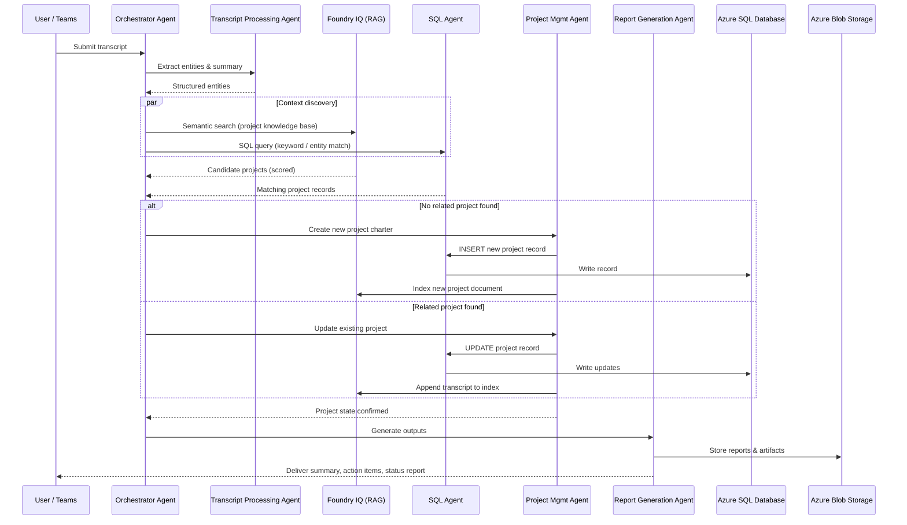

# Data Flow
{: .no_toc }

This page walks through the flow diagram that defines how PM Buddy processes meeting transcripts and manages project information.

---

## Table of Contents
{: .no_toc .text-delta }

- TOC
{:toc}

---

## Flow Diagram

The following diagram captures the core routing logic:

> **Reading the diagram:** Meeting transcripts enter on the left. The system checks whether related project information already exists in the database. Depending on the result, it either creates a new project record or adds to an existing one — then in both cases it generates reports and artifacts.

---

## Step-by-Step Walkthrough

### Step 1 — Transcript Ingestion

A meeting transcript arrives in one of several forms:

- **Teams Meeting recording** automatically transcribed by Azure AI Speech-to-Text
- **Uploaded `.vtt` / `.docx` / `.txt` file** processed by Azure AI Document Intelligence
- **Pasted plain text** submitted via the PM Buddy web or Teams interface

The Transcript Processing Agent normalizes the raw text, extracting:

| Extracted Element | Example |
|---|---|
| Project name / codename | "Project Atlas", "Q3 ERP rollout" |
| Key stakeholders | Names and roles mentioned |
| Action items | "John will deliver the spec by Friday" |
| Dates and milestones | "go-live March 31" |
| Risks and blockers | "vendor delay on hardware" |
| Topic summary | 2–3 sentence executive summary |

---

### Step 2 — Context Discovery (Existing Related Info?)

The Orchestrator Agent passes the extracted summary and entities to two parallel lookups:

| Lookup Channel | Method | Best For |
|---|---|---|
| **Foundry IQ** | Vector + semantic search over the project knowledge base | Fuzzy matching — "Project Atlas" might be stored as "Atlas Initiative" |
| **Azure SQL** | Keyword / entity-based query | Exact matches on project codes, owner IDs, or date ranges |

The results are merged and scored. If any existing project clears the confidence threshold, the flow takes the **YES** branch; otherwise it takes **NO**.

{: .note }
> **Why both channels?** Foundry IQ excels at semantic similarity across unstructured content (meeting notes, documents). Azure SQL provides authoritative structured records (budget, status codes, owners). Using them together reduces false negatives significantly.

---

### Step 3A — NO Branch: Create New Project

When no existing project is found, the Project Management Agent:

1. Drafts a new project charter from the extracted entities.
2. Generates an initial milestone plan (GPT-4o with PM-tuned system prompt).
3. Calls the SQL Agent to `INSERT` a new project record into Azure SQL with structured fields (name, owner, start date, status, budget estimate).
4. Indexes the new project document in Foundry IQ so future transcripts can match it.

---

### Step 3B — YES Branch: Add to Existing Project

When a related project is found, the Project Management Agent:

1. Retrieves the full project record from Azure SQL.
2. Merges new action items, dates, and stakeholder notes into the existing plan.
3. Identifies changes in scope, risk, or timeline and flags them.
4. Calls the SQL Agent to `UPDATE` the relevant rows (status, last-updated timestamp, milestone completion).
5. Appends the new transcript summary to the Foundry IQ document index.

---

### Step 4 — Reports, Artifacts, and Outputs

Regardless of which branch was taken, the Report Generation Agent produces:

| Output | Description |
|---|---|
| **Meeting Summary** | Concise summary with decisions made and open questions |
| **Action Item List** | Owners, due dates, and priority for each action |
| **Project Status Report** | Current milestone progress, risks, and next steps |
| **Updated Project Plan** | Revised task list and timeline if scope changed |
| **RACI Chart** | Who is Responsible, Accountable, Consulted, Informed |

Outputs are stored in Azure Blob Storage and optionally posted back to the originating Teams channel or shared via email.

---

## Sequence Diagram

---

## Data Residency and Compliance

All data — transcripts, project records, and generated artifacts — stays within the configured Azure region. Azure SQL and Blob Storage support encryption at rest and in transit. Access is governed by Microsoft Entra ID with role-based access control (RBAC).
