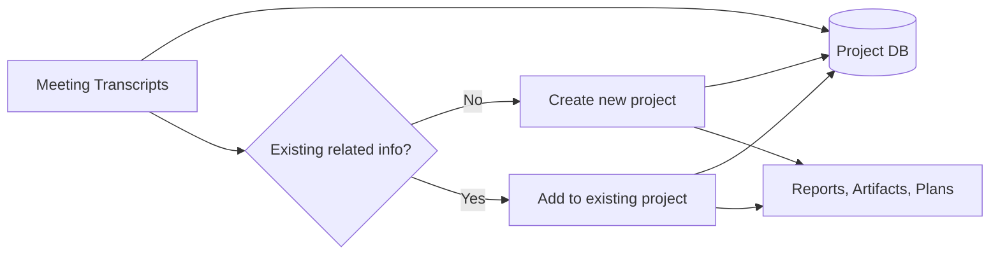
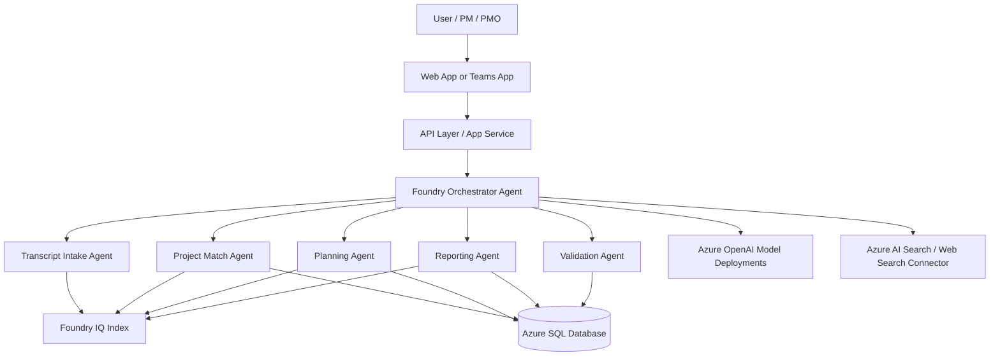

# High-Level Architecture

## Table of contents
{: .no_toc }
1. TOC
{:toc}

## Flow mapped from the design sketch

## Azure component model

## Service responsibilities

| Layer | Azure service | Purpose |
|---|---|---|
| Experience | App Service + optional Teams app | Submit transcripts, view generated plans/artifacts, approve changes |
| Agent runtime | Azure AI Foundry + Agent Framework | Multi-agent orchestration and tool-calling |
| Knowledge | Foundry IQ (+ optional Azure AI Search) | Semantic grounding over transcripts and project artifacts |
| Structured state | Azure SQL Database | Canonical system of record for projects and relational entities |
| Model inference | Azure OpenAI deployments | Extraction, reasoning, planning, and summarization |
| Safety & governance | Azure AI Content Safety + policy layer | Output moderation and policy controls |

## Why SQL still matters when using Foundry IQ

Foundry IQ and SQL are complementary:

- Foundry IQ: best for semantic retrieval over unstructured text and evolving knowledge.
- SQL: best for transactional integrity, explicit relationships, and deterministic updates.

Use SQL for:
- project identity and lifecycle state,
- canonical milestone/task ownership,
- audit trails and approvals,
- versioned artifacts metadata.

Use Foundry IQ for:
- transcript grounding,
- historical narrative retrieval,
- semantic matching beyond exact keys,
- citation-aware generation.

## Recommended data model (minimum)

- `Projects` (project_id, title, status, owner, created_at, updated_at)
- `Meetings` (meeting_id, project_id nullable, transcript_uri, meeting_date)
- `Decisions` (decision_id, project_id, source_meeting_id, decision_text, confidence)
- `ActionItems` (action_id, project_id, owner, due_date, status, source_meeting_id)
- `Artifacts` (artifact_id, project_id, type, uri, version, created_by_agent)
- `PlanVersions` (plan_version_id, project_id, summary, effective_date)

## End-to-end sequence

1. Transcript is submitted and normalized.
2. Transcript Intake Agent extracts structured signals.
3. Project Match Agent checks SQL identity + Foundry IQ semantic neighbors.
4. Orchestrator branches create vs update.
5. Planning Agent generates/revises plan with citations.
6. Reporting Agent generates status report and artifacts.
7. Validation Agent checks policy, confidence, completeness.
8. Approved outputs are persisted to SQL and indexed back into Foundry IQ.
