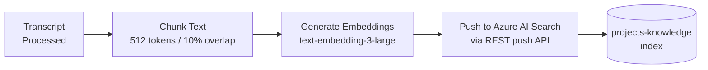
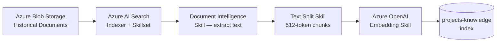

# Foundry IQ Integration
{: .no_toc }

Foundry IQ is PM Buddy's knowledge-base layer — a Retrieval-Augmented Generation (RAG) pipeline built on Azure AI Search and surfaced through Azure AI Foundry. It gives agents access to the full history of project documents, past meeting summaries, and organizational knowledge without stuffing everything into a single LLM context window.

---

## Table of Contents
{: .no_toc .text-delta }

- TOC
{:toc}

---

## What Is Foundry IQ?

Within the Azure AI Foundry platform, **Foundry IQ** refers to the integrated knowledge retrieval capability that combines:

| Component | Role |
|---|---|
| **Azure AI Search** | Vector store + semantic ranker + keyword index |
| **Azure OpenAI Embeddings** | Converts text chunks into high-dimensional vectors |
| **Azure AI Foundry Connections** | Wires the search index into agent tool calls |
| **RAG Orchestration** | Query → Retrieve → Augment → Generate pipeline |

Foundry IQ allows PM Buddy agents to ask natural-language questions like *"What decisions were made in the last three Atlas Initiative meetings?"* and receive grounded, cited answers — even when those decisions are buried in dozens of meeting summary documents.

---

## Why Foundry IQ vs. SQL Alone?

| Query Type | Azure SQL | Foundry IQ |
|---|---|---|
| "Get project with ID = 42" | ✅ Exact lookup | ❌ Not designed for this |
| "Projects owned by David Kim" | ✅ Structured query | ⚠️ Possible but imprecise |
| "Find projects similar to this cloud migration transcript" | ❌ No semantic understanding | ✅ Vector similarity search |
| "What risks have come up across all our ERP projects?" | ⚠️ Only if risks are structured | ✅ Full-text + semantic over all documents |
| "What did we decide in last month's Atlas meetings?" | ❌ Not stored as text | ✅ Meeting summaries indexed |
| "Show me the latest status for all active projects" | ✅ Structured aggregation | ❌ Inconsistent |

**Conclusion:** SQL owns authoritative structured state. Foundry IQ owns semantic retrieval over unstructured historical content. Both are essential — neither replaces the other.

---

## Index Architecture

PM Buddy maintains two Azure AI Search indexes:

### Index 1: `projects-knowledge`

Stores chunked content from project documents, meeting summaries, and generated reports.

```json
{
  "name": "projects-knowledge",
  "fields": [
    {"name": "id",           "type": "Edm.String",       "key": true},
    {"name": "project_id",   "type": "Edm.String",       "filterable": true},
    {"name": "doc_type",     "type": "Edm.String",       "filterable": true},
    {"name": "content",      "type": "Edm.String",       "searchable": true, "analyzer": "en.microsoft"},
    {"name": "summary",      "type": "Edm.String",       "searchable": true},
    {"name": "meeting_date", "type": "Edm.DateTimeOffset","filterable": true, "sortable": true},
    {"name": "embedding",    "type": "Collection(Edm.Single)", "dimensions": 3072,
                              "vectorSearchProfile": "hnsw-3072"}
  ],
  "vectorSearch": {
    "profiles": [{"name": "hnsw-3072", "algorithm": "hnsw"}],
    "algorithms": [{"name": "hnsw", "kind": "hnsw",
                    "parameters": {"m": 4, "efConstruction": 400, "efSearch": 500}}]
  },
  "semanticSearch": {
    "defaultConfiguration": "pm-semantic",
    "configurations": [{
      "name": "pm-semantic",
      "prioritizedFields": {
        "contentFields":  [{"fieldName": "content"}],
        "keywordsFields": [{"fieldName": "summary"}]
      }
    }]
  }
}
```

### Index 2: `projects-metadata`

Lightweight index for project-level metadata used by the Project Context Agent for initial candidate filtering before fetching full documents.

```json
{
  "name": "projects-metadata",
  "fields": [
    {"name": "project_id",   "type": "Edm.String", "key": true},
    {"name": "name",         "type": "Edm.String", "searchable": true},
    {"name": "description",  "type": "Edm.String", "searchable": true},
    {"name": "keywords",     "type": "Collection(Edm.String)", "searchable": true, "filterable": true},
    {"name": "owner",        "type": "Edm.String", "filterable": true},
    {"name": "status",       "type": "Edm.String", "filterable": true},
    {"name": "embedding",    "type": "Collection(Edm.Single)", "dimensions": 3072,
                              "vectorSearchProfile": "hnsw-3072"}
  ]
}
```

---

## Data Ingestion Pipeline

Documents enter the Foundry IQ index through two paths:

### Real-Time Indexing (Post-Processing)

After each transcript is processed and a project record is created or updated, PM Buddy immediately indexes the new content:



**Chunking strategy:**
- Chunk size: 512 tokens
- Overlap: 10% (51 tokens) to preserve cross-boundary context
- Chunk metadata includes: `project_id`, `doc_type`, `meeting_date`, `chunk_index`

### Batch Indexing (Historical Data)

For onboarding existing project documents:



The Azure AI Search **Indexer + Skillset** handles document cracking (PDF, DOCX, VTT), text extraction via Document Intelligence skill, chunking, and embedding — all as a managed pipeline with scheduled re-indexing.

---

## Search Configuration

Foundry IQ uses **hybrid search** — combining keyword (BM25) and vector (HNSW) search, then re-ranked by the semantic ranker:

```python
# Project Context Agent — Foundry IQ search (conceptual)
from azure.search.documents import SearchClient
from azure.search.documents.models import VectorizedQuery

def foundry_iq_search(query: str, project_filter: str = None, top_k: int = 5):
    embedding = get_embedding(query)  # text-embedding-3-large

    vector_query = VectorizedQuery(
        vector=embedding,
        k_nearest_neighbors=50,
        fields="embedding"
    )

    results = search_client.search(
        search_text=query,           # Keyword (BM25)
        vector_queries=[vector_query],  # Vector (HNSW)
        query_type="semantic",
        semantic_configuration_name="pm-semantic",
        filter=f"project_id eq '{project_filter}'" if project_filter else None,
        select=["id", "project_id", "doc_type", "content", "summary", "meeting_date"],
        top=top_k
    )

    return [
        {
            "project_id": r["project_id"],
            "content": r["content"],
            "score": r["@search.reranker_score"],
            "doc_type": r["doc_type"],
            "meeting_date": r["meeting_date"],
        }
        for r in results
    ]
```

### Search Mode Comparison

| Mode | Recall | Precision | Best For |
|---|---|---|---|
| Keyword only | Medium | High | Exact term matches |
| Vector only | High | Medium | Semantic similarity |
| Hybrid (keyword + vector) | High | High | General retrieval |
| Hybrid + semantic reranker | Highest | Highest | PM Buddy production |

The semantic reranker adds ~100ms latency but substantially improves result relevance for complex PM queries. This trade-off is acceptable for PM Buddy's use case.

---

## Foundry IQ in the Agent Framework

Foundry IQ is exposed to agents as a **Semantic Kernel plugin**:

```python
from semantic_kernel import Kernel
from semantic_kernel.functions import kernel_function

class FoundryIQPlugin:
    """Azure AI Foundry IQ knowledge retrieval plugin."""

    def __init__(self, search_client: SearchClient, embedding_client):
        self._search = search_client
        self._embed = embedding_client

    @kernel_function(
        name="search_projects",
        description="Search the project knowledge base for documents semantically related to the query."
    )
    async def search_projects(self, query: str, top_k: int = 5) -> str:
        results = foundry_iq_search(query, top_k=top_k)
        return "\n\n".join(
            f"[{r['doc_type']} | {r['meeting_date']}]\n{r['content']}"
            for r in results
        )

    @kernel_function(
        name="find_related_projects",
        description="Find existing projects most similar to a transcript summary."
    )
    async def find_related_projects(self, summary: str) -> str:
        results = foundry_iq_search(summary, top_k=10)
        # Deduplicate by project_id, keep highest score per project
        seen = {}
        for r in results:
            pid = r["project_id"]
            if pid not in seen or r["score"] > seen[pid]["score"]:
                seen[pid] = r
        return str(list(seen.values()))

kernel.add_plugin(FoundryIQPlugin(search_client, embed_client), plugin_name="foundry_iq")
```

---

## Foundry IQ Configuration in Azure AI Foundry

```yaml
# Azure AI Foundry — Knowledge connection (conceptual)
knowledge_bases:
  - name: pm-knowledge-base
    type: AzureAISearch
    connection: aisearch-connection
    index_name: projects-knowledge
    embedding_connection: openai-connection
    embedding_model: text-embedding-3-large
    search_type: hybrid              # keyword + vector + semantic
    top_k: 5
    reranker: semantic
    chunk_size: 512
    chunk_overlap: 51
    citation_format: "[{doc_type} | {meeting_date}]"
```

This configuration is consumed by agents declared in the Foundry project. Agents with `tools: [foundry_iq]` automatically have access to `search_projects` and `find_related_projects` without additional plumbing.

---

## Freshness and Index Maintenance

| Event | Index Action |
|---|---|
| New transcript processed | Immediate push index update |
| Project record created | Project metadata index updated |
| Report generated | Report document chunked and indexed |
| Project closed | Documents retained; status filter updated |
| Document deleted / corrected | Hard delete from index via document key |

A scheduled Azure AI Search **indexer** re-processes Blob Storage daily at 02:00 UTC to catch any documents that missed the real-time push path (e.g., due to transient failures).

---

## Responsible AI Considerations for Foundry IQ

{: .important }
> **Grounding reduces hallucination.** When agents cite Foundry IQ results, they are constrained to actual historical project content. This is measurably safer than relying on model memory alone for project facts.

| Concern | Mitigation |
|---|---|
| Stale documents affecting decisions | Recency boost in semantic search; `meeting_date` sortable field |
| PII in indexed content | PII redaction applied before indexing; field-level access control via Entra ID |
| Cross-project data leakage | `project_id` filter ensures agents only retrieve content they are authorized for |
| Index poisoning via malicious transcript | Content Safety filter applied before indexing |
