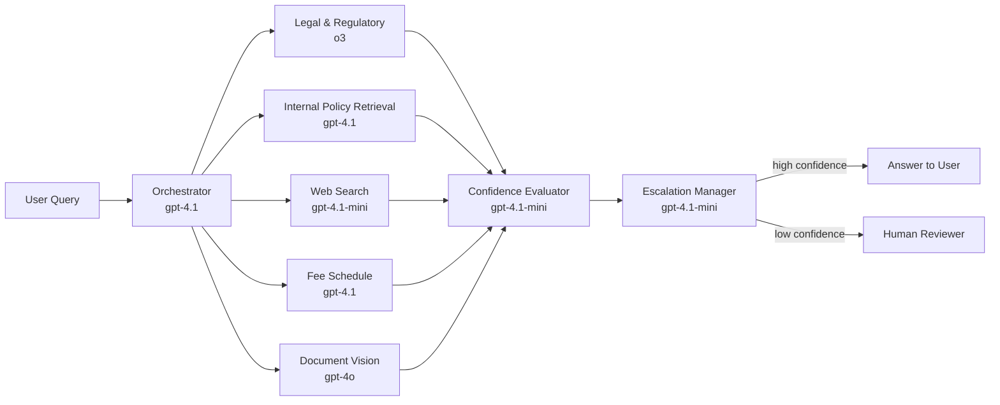

# Multi-Agent Design
{: .no_toc }

## Table of Contents
{: .no_toc .text-delta }

1. TOC
{:toc}

---

## Why Multi-Agent?

A single monolithic agent tasked with answering all policy questions would require an impossibly broad system prompt, unreliable tool selection, and opaque reasoning chains. The **multi-agent pattern** decomposes the problem surface:

- **Specialisation** — each agent is sovereign over a narrow domain, using a focused system prompt.
- **Parallelism** — the orchestrator can invoke internal and web search agents **simultaneously**, halving latency on compound queries.
- **Replaceability** — individual agents can be upgraded or swapped (e.g., switching from Bing to a custom crawler) without rebuilding the whole system.
- **Auditability** — each agent's inputs, outputs, and tool calls are independently logged, enabling fine-grained debugging and compliance review.

---

## Model Specialisation Strategy

Policy Bot deliberately assigns **a different model to each agent role** based on the cognitive demands of that role. Running every agent on the most capable (and most expensive) model is wasteful; running every agent on the cheapest model sacrifices accuracy where it matters most.

### Model–Agent Assignment

| Agent | Model | Why this model |
|---|---|---|
| **Orchestrator** | `gpt-4.1` | Needs strong multi-step reasoning to decompose queries, route sub-tasks, and synthesise heterogeneous agent outputs. |
| **Legal & Regulatory Interpretation** | `o3` | Complex regulatory text requires multi-step deductive reasoning over long contexts. `o3`'s chain-of-thought excels here. |
| **Internal Policy Retrieval** | `gpt-4.1` | RAG synthesis over retrieved chunks; needs instruction-following and faithful citation. |
| **Web Search** | `gpt-4.1-mini` | Summarises web pages — high-frequency, lower-stakes; latency and cost matter more than deep reasoning. |
| **Fee Schedule** | `gpt-4.1` | Tabular reasoning over structured and semi-structured data; needs reliable function calling and numerical accuracy. |
| **Document Vision** | `gpt-4o` | Scanned PDFs, image-based fee schedules, and diagram-heavy regulatory docs require a native vision model. |
| **Confidence Evaluator** | `gpt-4.1-mini` | Binary faithfulness / completeness scoring — well-defined structured output task; speed and cost matter. |
| **Escalation Manager** | `gpt-4.1-mini` | Routing decision with structured output; no generation required. |

### Capability-to-Model Mapping



### Why `o3` for Legal & Regulatory Interpretation?

Regulatory text — healthcare compliance rules, AHCA policy bulletins, Medicaid guidance — is dense, cross-referential, and exceptions-heavy. Answering correctly requires:

- Following nested conditionals across long sections.
- Identifying when a general rule has a specific exception.
- Determining effective dates and supersession across document versions.

`o3`'s internal chain-of-thought reasoning handles this class of problem significantly better than standard instruction-following models. The trade-off is higher latency and cost, which is acceptable because legal interpretation queries are less frequent and higher-stakes.

### Why `gpt-4o` for Document Vision?

Many source documents arrive as **scanned PDFs, photographed whiteboards, or image-embedded tables**. A text-only model cannot process these. The Document Vision Agent accepts image inputs natively, extracts structured content, and passes normalized text to downstream agents. This eliminates the need for a separate OCR pipeline for most common cases.

### Why `gpt-4.1-mini` for Evaluation and Routing?

The Confidence Evaluator and Escalation Manager perform **constrained, structured-output tasks** — they are not open-ended generators. Using a lightweight model here reduces cost per query by ~10–15× compared to `gpt-4.1` with no measurable quality loss on these specific subtasks.

---

## Agent Roster

### 1. Orchestrator Agent

| Attribute | Value |
|---|---|
| **Role** | Top-level router, query decomposer, and response assembler |
| **Model** | `gpt-4.1` |
| **Temperature** | 0.0 — deterministic routing decisions |
| **Key tools** | `route_to_agent`, `merge_responses`, `call_confidence_evaluator` |

The Orchestrator receives the raw user query and performs:

1. **Intent classification** — Is this a fee query, internal policy, regulatory question, or multi-part?
2. **Query decomposition** — Breaks compound questions into sub-queries assigned to specialist agents.
3. **Parallel execution** — Invokes sub-agents concurrently using `asyncio.gather`.
4. **Response synthesis** — Merges ranked sub-agent answers into a single coherent response.
5. **Confidence delegation** — Passes the draft answer to the Confidence Evaluator Agent.

```python
# Simplified Orchestrator using Azure AI Foundry Agent SDK
from azure.ai.projects import AIProjectClient
from azure.ai.projects.models import Agent, AgentThread, MessageRole
import asyncio

async def orchestrate(user_query: str, thread: AgentThread) -> dict:
    # Decompose query and fan out to specialist agents
    tasks = [
        asyncio.create_task(internal_policy_agent.run(user_query)),
        asyncio.create_task(web_search_agent.run(user_query)),
    ]
    results = await asyncio.gather(*tasks, return_exceptions=True)

    # Merge and evaluate confidence
    merged = merge_responses(results)
    confidence_result = await confidence_evaluator.run(user_query, merged)

    return {
        "answer": merged["text"],
        "sources": merged["sources"],
        "confidence": confidence_result["score"],
        "escalate": confidence_result["score"] < CONFIDENCE_THRESHOLD,
    }
```

---

### 1a. Legal & Regulatory Interpretation Agent

| Attribute | Value |
|---|---|
| **Role** | Deep reasoning over complex regulatory text, cross-referential rules, and compliance obligations |
| **Model** | `o3` |
| **Temperature** | 1.0 (o3 controls its own reasoning depth) |
| **Key tools** | `search_knowledge_index`, `fetch_document_chunk`, `compare_document_versions` |
| **Data source** | Foundry IQ — regulatory corpus (AHCA bulletins, Medicaid manuals, federal/state rules) |

This agent is invoked when the Orchestrator classifies a query as requiring **legal or regulatory interpretation** — not just lookup. It uses `o3`'s internal chain-of-thought to reason through nested conditions, effective-date logic, and exception hierarchies before producing a cited answer.

{: .important }
> `o3` reasoning calls are higher-latency (~5–20 s). The Orchestrator marks these queries as `reasoning_required: true` and shows the user a "Working on a complex policy question..." indicator while `o3` runs.

---

### 2. Internal Policy Agent

| Attribute | Value |
|---|---|
| **Role** | Retrieves answers from internal organisational policy documents |
| **Model** | `gpt-4.1` |
| **Temperature** | 0.1 |
| **Key tools** | `search_knowledge_index`, `fetch_document_chunk` |
| **Data source** | Foundry IQ knowledge index → Azure AI Search |

This agent executes a **RAG pipeline** against the organisation's internal document corpus:

1. Embeds the query using `text-embedding-3-large`.
2. Runs a **hybrid search** (vector + BM25 keyword) against Azure AI Search.
3. Retrieves the top-5 ranked chunks with metadata (doc title, section, last-modified date, author).
4. Constructs a grounded prompt window and calls GPT-4o for synthesis.
5. Returns the answer, source citations, and a per-source relevance score.

```
System Prompt (Internal Policy Agent):
"You are a policy retrieval assistant for [Organisation]. 
Answer questions ONLY using the document chunks provided below. 
Do not infer, fabricate, or extrapolate beyond the provided text. 
Always cite the document title and section. 
If the provided documents do not contain an answer, respond with: 
'I was unable to find this in the internal policy library.'"
```

---

### 2a. Document Vision Agent

| Attribute | Value |
|---|---|
| **Role** | Extracts structured content from scanned PDFs, image-based tables, and diagram-heavy policy documents |
| **Model** | `gpt-4o` (vision-capable) |
| **Temperature** | 0.0 |
| **Key tools** | `analyze_document_image`, `extract_table_from_image`, `ocr_pdf_page` |
| **Data source** | Azure Blob Storage — raw scanned document uploads |

Many policy source documents arrive as **scanned PDFs or image-embedded formats** that text-only models cannot process. This agent:

1. Accepts image or PDF page inputs directly.
2. Uses GPT-4o's native vision capability to read tables, forms, and annotated diagrams.
3. Outputs normalized structured text that downstream agents (Internal Policy, Fee Schedule) can consume.

This eliminates the need for a dedicated OCR microservice for most common document types.

---

### 3. Web Search Agent

| Attribute | Value |
|---|---|
| **Role** | Retrieves public regulatory, legislative, and industry policy information |
| **Model** | `gpt-4.1-mini` |
| **Temperature** | 0.1 |
| **Key tools** | `bing_web_search`, `scrape_url`, `summarise_page` |
| **Data source** | Bing Search API v7 |

This agent handles queries that go beyond internal documents — for example, changes to state or federal regulations, publicly published fee schedules, or agency guidance.

**Workflow:**

1. Reformulates the query into 1–3 optimised web search strings.
2. Calls Bing Search API, filtering for `.gov`, `.org`, or trusted domain sources where appropriate.
3. Fetches and summarises the top-3 result pages using an HTML-to-text extractor.
4. Synthesises a grounded response with URL citations.

{: .warning }
> Web Search Agent responses are marked with a `source_type: web` metadata flag. The Confidence Evaluator applies a **lower base confidence** to web-sourced answers versus internally-indexed documents, since web content is unverified against organisational standards.

---

### 4. Fee Schedule Agent

| Attribute | Value |
|---|---|
| **Role** | Resolves fee-related queries by analyzing complex tabular data in databases, spreadsheets, and policy documents |
| **Model** | `gpt-4.1` |
| **Temperature** | 0.0 |
| **Key tools** | `query_fee_table`, `extract_table_from_document`, `analyze_spreadsheet`, `lookup_service_code`, `calculate_fee` |
| **Data source** | Azure SQL / Azure Table Storage + Excel/CSV/PDF tabular artifacts in Blob/SharePoint |

Fee schedules are often spread across **heterogeneous tabular formats** (database rows, Excel sheets with merged headers, CSV extracts, and PDF tables). The Fee Schedule Agent uses LLM-powered table understanding to interpret these sources consistently:

1. Parses the user's service code, procedure, or description.
2. Chooses the best retrieval path:
   - parameterized SQL query for canonical structured records
   - spreadsheet parsing for multi-sheet rate workbooks
   - document table extraction for PDF/Word fee schedules.
3. Normalizes extracted table structures (header hierarchy, column semantics, units, effective dates, modifiers).
4. Uses GPT-4o to reason over normalized rows and answer complex questions (comparisons, exceptions, cross-table rule interactions) with explicit row/column citations.
5. Returns the fee value, effective date, modifier rules, and source trace back to exact table references.

```python
# Tool: analyze_spreadsheet
def analyze_spreadsheet(file_uri: str, question: str) -> dict:
    """
    Parse workbook/sheet/table structures, normalize headers,
    and return tabular context for LLM reasoning.
    """
    workbook = spreadsheet_parser.load(file_uri)
    tables = []
    for sheet in workbook.sheets:
        extracted = table_extractor.from_sheet(sheet)
        normalized = table_normalizer.normalize(
            extracted,
            preserve_header_hierarchy=True,
            infer_column_types=True,
        )
        tables.extend(normalized)
    return {
        "tables": tables,
        "source": file_uri,
        "question": question,
    }
```

```python
# Tool: query_fee_table
def query_fee_table(service_code: str, effective_date: str) -> dict:
    """
    Execute a parameterised query — NEVER use string interpolation
    to prevent SQL injection.
    """
    query = """
        SELECT ServiceCode, Description, Fee, EffectiveDate, ExpiryDate
        FROM FeeSchedule
        WHERE ServiceCode = ? AND EffectiveDate <= ? AND (ExpiryDate IS NULL OR ExpiryDate > ?)
    """
    return db.execute(query, (service_code, effective_date, effective_date)).fetchone()
```

{: .note }
> For spreadsheet/document-driven answers, the Fee Schedule Agent includes source-level table citations (file name, sheet/table name, row range, column names) so the Confidence Evaluator can validate faithfulness against exact tabular evidence.

---

### 5. Confidence Evaluator Agent

| Attribute | Value |
|---|---|
| **Role** | Scores the reliability of the draft answer against the retrieved sources |
| **Model** | GPT-4o |
| **Temperature** | 0.0 |
| **Key tools** | `score_faithfulness`, `score_relevance`, `score_completeness` |

The Confidence Evaluator is a **meta-agent** — it does not generate answers; it evaluates them. See [Confidence Scoring](../confidence-scoring/) for full details.

---

### 6. Escalation Manager Agent

| Attribute | Value |
|---|---|
| **Role** | Coordinates human-in-the-loop review when confidence < threshold |
| **Model** | GPT-4o-mini (cost-efficient; no heavy reasoning needed) |
| **Temperature** | 0.0 |
| **Key tools** | `send_teams_adaptive_card`, `send_email_notification`, `track_escalation` |

The Escalation Manager is triggered by the Orchestrator when the Confidence Evaluator returns a score below threshold. See [Human-in-the-Loop](../human-in-the-loop/) for full details.

---

## Agent Communication Pattern

Policy Bot uses a **hub-and-spoke orchestration** pattern rather than a peer-to-peer mesh:

```
              ┌─────────────────┐
              │   Orchestrator  │  ← Hub
              └────────┬────────┘
          ┌────────────┼────────────┐
          ▼            ▼            ▼
    [Policy Agent] [Web Agent]  [Fee Agent]   ← spokes (parallel)
                        │
                        ▼
              [Confidence Evaluator]
                        │
                  (if low score)
                        ▼
              [Escalation Manager]
```

- **No direct agent-to-agent calls** except from Orchestrator.
- The Orchestrator maintains a **shared context object** (Python dict / Pydantic model) passed to each agent.
- All agent results are returned to the Orchestrator, which owns the assembly and final response composition.

---

## Agent Implementation with Foundry Agent SDK

```python
from azure.ai.projects import AIProjectClient
from azure.ai.projects.models import (
    Agent,
    AgentThread,
    BingGroundingToolDefinition,
    AzureAISearchTool,
    FunctionTool,
)
from azure.identity import DefaultAzureCredential

project = AIProjectClient(
    endpoint="https://<foundry-endpoint>.api.azureml.ms",
    credential=DefaultAzureCredential(),
)

# Create the Internal Policy Agent
internal_agent: Agent = project.agents.create_agent(
    model="gpt-4o",
    name="internal-policy-agent",
    instructions=INTERNAL_POLICY_SYSTEM_PROMPT,
    tools=[
        AzureAISearchTool(
            index_connection_id="/subscriptions/.../connections/policy-search",
            index_name="policy-index",
        )
    ],
)

# Create the Web Search Agent
web_agent: Agent = project.agents.create_agent(
    model="gpt-4o",
    name="web-search-agent",
    instructions=WEB_SEARCH_SYSTEM_PROMPT,
    tools=[
        BingGroundingToolDefinition(
            connection_id="/subscriptions/.../connections/bing-search"
        )
    ],
)

# Create a shared thread for the user's session
thread: AgentThread = project.agents.threads.create()
```

---

## Single-Agent Mode

For simple, unambiguous queries, the Orchestrator can short-circuit the fan-out and invoke a **single specialist agent** directly, bypassing parallel execution:

```python
async def orchestrate(user_query: str) -> dict:
    intent = await classify_intent(user_query)

    if intent == "fee_lookup":
        return await fee_schedule_agent.run(user_query)
    elif intent == "simple_internal_policy":
        return await internal_policy_agent.run(user_query)
    else:
        # Full multi-agent fan-out
        return await full_orchestration(user_query)
```

This optimisation reduces latency and token cost for the ~40–60% of queries that have clear, single-domain intent.
