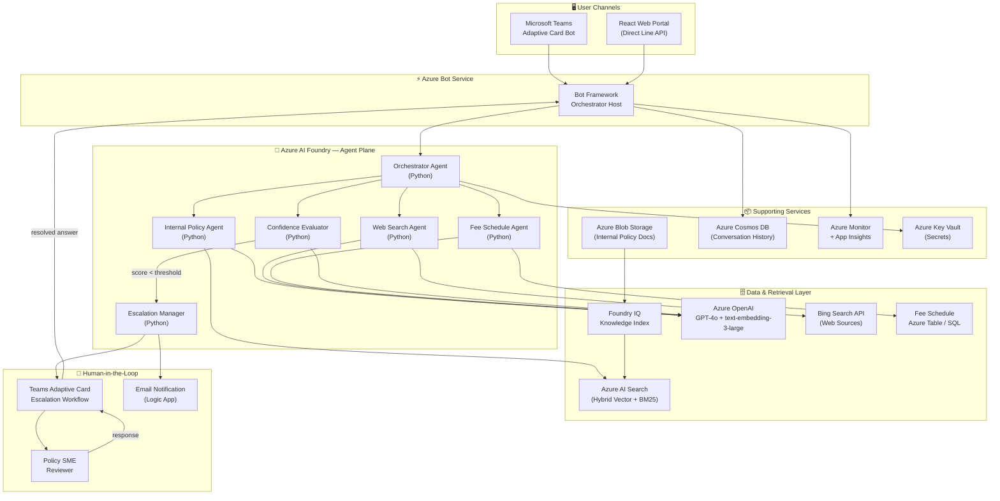
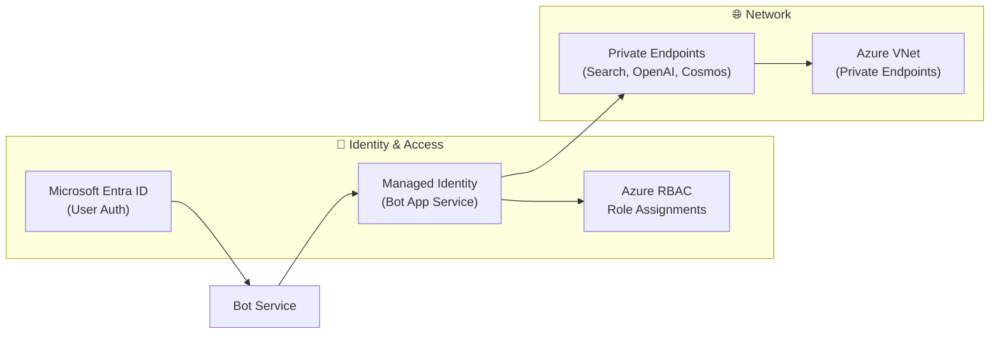

# Architecture
{: .no_toc }

## Table of Contents
{: .no_toc .text-delta }

1. TOC
{:toc}

---

## High-Level Component Diagram



---

## Azure Services Reference

| Service | Role in Policy Bot | SKU Recommendation |
|---|---|---|
| **Azure AI Foundry** | Central platform hosting agents, evaluations, and model deployments | Standard |
| **Azure OpenAI Service** | GPT-4o for generation; `text-embedding-3-large` for embeddings | S0 (PTU for prod) |
| **Azure AI Search** | Hybrid vector + keyword retrieval over internal policy corpus | Standard S1+ |
| **Azure Bot Service** | Channel host and routing for Teams + Web Portal | F0 (dev) / S1 (prod) |
| **Bing Search API** | Live web search for public regulatory/policy content | S2 |
| **Foundry IQ** | Knowledge index lifecycle (ingestion, chunking, embedding, freshness) | Foundry-managed |
| **Azure Blob Storage** | Raw internal policy documents (.docx, .pdf, .html) | LRS Hot |
| **Azure Cosmos DB** | Conversation history, session state, audit log | Serverless |
| **Azure Key Vault** | API keys, connection strings, service principals | Standard |
| **Azure Monitor / App Insights** | Telemetry, latency tracking, cost monitoring | Standard |
| **Azure Logic Apps** | Email escalation notifications | Consumption |
| **Microsoft Teams** | Primary end-user chat surface via Teams Bot manifest | N/A |

---

## Data Flow: Happy Path (High Confidence)

```
User sends question via Teams or Web Portal
         │
         ▼
Azure Bot Service receives activity
         │
         ▼
Orchestrator Agent analyses query intent
         │
    ┌────┴────────────────┐
    ▼                     ▼
Internal Policy Agent   Web Search Agent
(Foundry IQ / AI Search) (Bing API)
    │                     │
    └──────┬──────────────┘
           ▼
    Merge retrieved chunks
           │
           ▼
    Orchestrator drafts answer (GPT-4o)
           │
           ▼
    Confidence Evaluator scores answer
           │
    confidence ≥ threshold (e.g. 0.75)
           │
           ▼
    Response with sources + score sent to user
```

---

## Data Flow: Escalation Path (Low Confidence)

```
... same as above up to Confidence Evaluator ...
           │
    confidence < threshold
           │
           ▼
    Escalation Manager triggered
           │
    ┌──────┴──────────┐
    ▼                 ▼
Teams Adaptive Card   Email (Logic App)
sent to SME queue     notification
           │
           ▼
    Human Reviewer sees question + bot's
    draft answer + source citations
           │
           ▼
    Reviewer submits authoritative answer
           │
           ▼
    Answer delivered to user via Bot Service
    (conversation thread resumed)
```

---

## Security Architecture



- **No API keys stored in code** — all credentials are read from Azure Key Vault at runtime via Managed Identity.
- **Private endpoints** enabled for Azure AI Search, Azure OpenAI, and Cosmos DB in production.
- **User authentication** enforced through Microsoft Entra ID SSO on the Web Portal; Teams uses the native Teams identity.
- **Data residency** — all services provisioned in the same Azure region to prevent cross-border data transfer.

---

## Scalability Considerations

| Concern | Approach |
|---|---|
| **LLM latency** | Use Provisioned Throughput Units (PTU) for GPT-4o to eliminate throttling under load. |
| **Search throughput** | Azure AI Search Standard S2/S3 with replicas for parallel query handling. |
| **Agent fan-out** | Orchestrator spawns sub-agents asynchronously using `asyncio.gather`. |
| **Conversation state** | Cosmos DB with Serverless billing; TTL policy to purge old sessions. |
| **Bot hosting** | Azure Container Apps or App Service Premium with auto-scale rules. |
