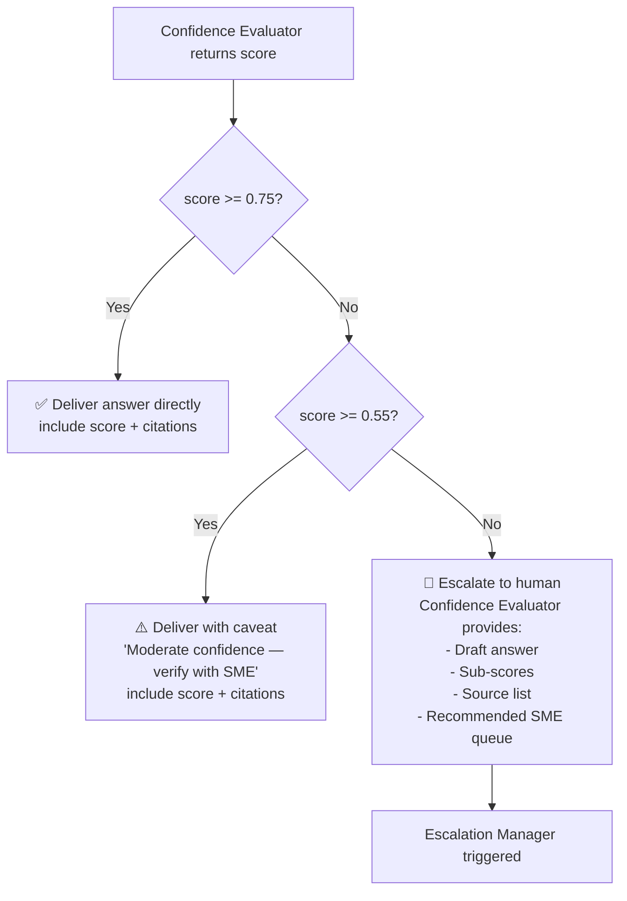

# Confidence Scoring
{: .no_toc }

## Table of Contents
{: .no_toc .text-delta }

1. TOC
{:toc}

---

## Overview

Every answer produced by Policy Bot is accompanied by a **confidence score** — a float in the range **[0.0, 1.0]** — that represents the system's self-assessed reliability of the response. This score drives:

- Whether the answer is delivered directly to the user.
- Whether the answer is flagged with a caveat ("moderate confidence").
- Whether human escalation is triggered.

{: .important }
> Confidence scoring is **not** a single LLM call asking "how confident are you?" (which is susceptible to over-confidence bias). It is a **multi-dimensional evaluation** performed by the dedicated Confidence Evaluator Agent using three independently calculated sub-scores.

---

## The Three-Dimensional Confidence Framework

### Dimension 1: Faithfulness Score

Measures whether the generated answer is fully supported by the retrieved source documents — i.e., no fabricated or hallucinated content.

**Method:** The Confidence Evaluator submits the draft answer and the source document chunks to GPT-4o with a structured evaluation prompt:

```
Faithfulness Evaluation Prompt:
"Compare the following ANSWER to the SOURCE DOCUMENTS.
For each claim in the answer, determine if it is directly supported by the sources.
Return a JSON object: { "supported_claims": int, "total_claims": int, "faithfulness_score": float }
Faithfulness score = supported_claims / total_claims."
```

| Faithfulness Score | Interpretation |
|---|---|
| 1.0 | All claims are directly supported. |
| 0.8 – 0.99 | Minor inferences present; generally trustworthy. |
| 0.5 – 0.79 | Some claims lack source support — moderate risk. |
| < 0.5 | Significant hallucination risk — escalate. |

---

### Dimension 2: Relevance Score

Measures how well the retrieved chunks actually answer the user's question — i.e., whether the right documents were found.

**Method:** Azure AI Search provides a **reranker score** (via its semantic ranker) for each retrieved chunk. The top-N reranker scores are aggregated:

```python
def compute_relevance_score(search_results: list[dict]) -> float:
    if not search_results:
        return 0.0
    # Semantic reranker scores are in [0, 4] — normalise to [0, 1]
    scores = [r["@search.rerankerScore"] / 4.0 for r in search_results[:5]]
    # Weight top result more heavily
    weights = [0.4, 0.25, 0.15, 0.12, 0.08]
    return sum(s * w for s, w in zip(scores, weights[:len(scores)]))
```

---

### Dimension 3: Completeness Score

Measures whether the answer addresses all meaningful sub-parts of the user's question.

**Method:** The Orchestrator extracts question sub-intents at decomposition time (e.g., "what is the fee?" + "when does it apply?"). The Confidence Evaluator checks whether each sub-intent has been addressed in the final answer:

```python
def compute_completeness_score(sub_intents: list[str], answer: str) -> float:
    addressed = 0
    for intent in sub_intents:
        # Uses GPT-4o-mini for cost-efficiency on binary checks
        result = check_intent_addressed(intent, answer)
        if result["addressed"]:
            addressed += 1
    return addressed / len(sub_intents) if sub_intents else 1.0
```

---

## Composite Confidence Score

The three sub-scores are combined using a **weighted geometric mean** (rather than arithmetic mean) to ensure that a very low score in any single dimension substantially penalises the composite:

$$
\text{confidence} = F^{w_F} \times R^{w_R} \times C^{w_C}
$$

Where:
- $F$ = Faithfulness score, $w_F = 0.50$
- $R$ = Relevance score, $w_R = 0.30$
- $C$ = Completeness score, $w_C = 0.20$

**Default weights rationale:**

| Weight | Dimension | Rationale |
|---|---|---|
| 0.50 | Faithfulness | Hallucination is the highest-risk failure mode for a policy bot. |
| 0.30 | Relevance | Wrong documents are the second most common failure. |
| 0.20 | Completeness | Partial answers are less dangerous than wrong answers. |

```python
import math

def composite_confidence(
    faithfulness: float,
    relevance: float,
    completeness: float,
    w_f: float = 0.50,
    w_r: float = 0.30,
    w_c: float = 0.20,
) -> float:
    """Weighted geometric mean of the three confidence dimensions."""
    # Guard: avoid log(0) with a small epsilon floor
    f = max(faithfulness, 1e-6)
    r = max(relevance, 1e-6)
    c = max(completeness, 1e-6)
    return math.exp(w_f * math.log(f) + w_r * math.log(r) + w_c * math.log(c))
```

---

## Source Type Modifier

Web-sourced answers receive a **source type penalty** because web content has not been validated against organisational standards:

| Source Mix | Modifier |
|---|---|
| 100% internal documents | ×1.00 (no penalty) |
| Mix of internal + web | ×0.90 |
| 100% web sources | ×0.80 |

```python
def apply_source_modifier(score: float, source_types: list[str]) -> float:
    internal_ratio = source_types.count("internal") / len(source_types)
    if internal_ratio == 1.0:
        return score
    elif internal_ratio > 0.5:
        return score * 0.90
    else:
        return score * 0.80
```

---

## Threshold Configuration

Thresholds are stored in **Azure App Configuration** (or environment variables) to allow tuning without redeployment:

```yaml
# policy_bot_config.yaml
confidence:
  auto_answer_threshold: 0.75    # Score >= this → answer directly
  warn_threshold: 0.55           # Score in [0.55, 0.75) → answer with caveat
  escalate_threshold: 0.55       # Score < this → trigger human escalation
  fee_agent_threshold: 0.90      # Fee lookups require higher confidence
```

---

## Decision Logic



---

## Response Format with Confidence

Every answer delivered to the user includes a structured confidence block, rendered as a Teams Adaptive Card or HTML summary:

```json
{
  "answer": "The co-payment for a standard office visit is $35, effective from January 1, 2025.",
  "confidence": {
    "composite_score": 0.82,
    "faithfulness": 0.95,
    "relevance": 0.78,
    "completeness": 1.00,
    "source_modifier": 1.0,
    "level": "high"
  },
  "sources": [
    {
      "title": "AHCA Fee Schedule 2025",
      "section": "Section 4.2 — Office Visit Co-payments",
      "url": "https://sharepoint.../fee-schedule-2025.pdf",
      "relevance_score": 0.91
    }
  ]
}
```

---

## Calibration and Monitoring

Confidence scores are logged to **Azure Monitor / Application Insights**. A monthly calibration review compares confidence scores against human reviewer verdicts (for escalated cases):

| Metric | Target |
|---|---|
| Escalation rate | < 15% of queries |
| False negative rate (missed escalations) | < 2% |
| Score–accuracy Pearson correlation | > 0.70 |

Threshold values should be adjusted every quarter based on this calibration review.
