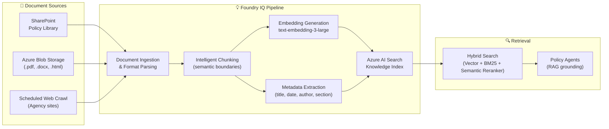

# Foundry IQ
{: .no_toc }

## Table of Contents
{: .no_toc .text-delta }

1. TOC
{:toc}

---

## What Is Foundry IQ?

**Foundry IQ** is Microsoft's intelligence and knowledge management capability embedded within Azure AI Foundry. It automates the full lifecycle of grounded knowledge — from document ingestion through chunking, embedding, indexing, and freshness monitoring — removing the need for hand-crafted RAG pipelines.

For Policy Bot, Foundry IQ serves as the **authoritative knowledge backbone** that the Internal Policy Agent queries to retrieve accurate, up-to-date policy content.



---

## Knowledge Index Structure

The Foundry IQ knowledge index uses the following **Azure AI Search index schema**:

```json
{
  "name": "policy-index",
  "fields": [
    { "name": "id", "type": "Edm.String", "key": true },
    { "name": "document_id", "type": "Edm.String", "filterable": true },
    { "name": "title", "type": "Edm.String", "searchable": true, "retrievable": true },
    { "name": "section", "type": "Edm.String", "searchable": true, "retrievable": true },
    { "name": "content", "type": "Edm.String", "searchable": true, "retrievable": true },
    { "name": "content_vector", "type": "Collection(Edm.Single)",
      "searchable": true, "dimensions": 3072,
      "vectorSearchProfile": "text-embedding-3-large-profile" },
    { "name": "source_url", "type": "Edm.String", "retrievable": true },
    { "name": "source_type", "type": "Edm.String", "filterable": true,
      "comment": "Values: internal | web" },
    { "name": "topic_tags", "type": "Collection(Edm.String)", "filterable": true, "facetable": true },
    { "name": "effective_date", "type": "Edm.DateTimeOffset", "filterable": true, "sortable": true },
    { "name": "last_modified", "type": "Edm.DateTimeOffset", "filterable": true, "sortable": true },
    { "name": "version", "type": "Edm.String", "filterable": true, "retrievable": true },
    { "name": "author", "type": "Edm.String", "retrievable": true },
    { "name": "language", "type": "Edm.String", "filterable": true }
  ],
  "vectorSearch": {
    "profiles": [{
      "name": "text-embedding-3-large-profile",
      "algorithm": "hnsw-config"
    }],
    "algorithms": [{
      "name": "hnsw-config",
      "kind": "hnsw",
      "hnswParameters": {
        "metric": "cosine",
        "m": 4,
        "efConstruction": 400,
        "efSearch": 500
      }
    }]
  },
  "semantic": {
    "configurations": [{
      "name": "policy-semantic-config",
      "prioritizedFields": {
        "titleField": { "fieldName": "title" },
        "contentFields": [{ "fieldName": "content" }],
        "keywordsFields": [{ "fieldName": "section" }, { "fieldName": "topic_tags" }]
      }
    }]
  }
}
```

---

## Document Ingestion Pipeline

### Source Connectors

Foundry IQ connects to document sources via Foundry data connections:

```python
from azure.ai.projects import AIProjectClient
from azure.ai.projects.models import (
    SharePointDataSource,
    BlobStorageDataSource,
    IndexingSchedule,
)

project = AIProjectClient(...)

# 1. Connect SharePoint policy library
sp_connection = project.connections.create(
    SharePointDataSource(
        name="sharepoint-policy-library",
        site_url="https://[org].sharepoint.com/sites/PolicyLibrary",
        relative_path="/Shared Documents/Policies",
        auth_type="managed_identity",
    )
)

# 2. Connect Blob Storage for PDF archive
blob_connection = project.connections.create(
    BlobStorageDataSource(
        name="blob-policy-archive",
        account_url="https://policybotstore.blob.core.windows.net",
        container_name="policy-docs",
        auth_type="managed_identity",
    )
)
```

### Chunking Strategy

Foundry IQ uses **semantic chunking** rather than fixed-size token splits. This preserves policy clause boundaries:

| Parameter | Value | Rationale |
|---|---|---|
| `chunk_size` | 512 tokens | Balances context richness and precision |
| `chunk_overlap` | 64 tokens | Prevents clause fragmentation at chunk boundaries |
| `chunking_strategy` | `semantic` | Splits at paragraph/section boundaries, not mid-sentence |
| `min_chunk_size` | 128 tokens | Discards fragment-level chunks that lack context |

```python
# Foundry IQ Knowledge Index configuration
knowledge_index = project.indexes.create(
    name="policy-index",
    search_service_connection_id=search_connection.id,
    index_name="policy-index",
    embedding_model_connection_id=aoai_connection.id,
    embedding_model_name="text-embedding-3-large",
    chunking=ChunkingConfiguration(
        strategy="semantic",
        max_chunk_size=512,
        chunk_overlap=64,
    ),
    metadata_extraction=MetadataExtractionConfig(
        extract_title=True,
        extract_author=True,
        extract_dates=True,
        custom_fields=["section", "effective_date", "version"],
    ),
)
```

---

## Hybrid Search Configuration

The Internal Policy Agent executes a **three-part hybrid search** query for every retrieval:

### Query Flow

```
User query
    │
    ├─ 1. Vector Search (semantic similarity)
    │       Uses text-embedding-3-large embedding
    │       k=10 nearest neighbours (cosine)
    │
    ├─ 2. BM25 Keyword Search
    │       Full-text match with TF-IDF scoring
    │
    ├─ 3. Reciprocal Rank Fusion (RRF)
    │       Merges vector + BM25 ranked lists
    │       RRF formula: 1 / (rank + 60)
    │
    └─ 4. Semantic Reranker
            Cross-encoder reranking of top-50 results
            Returns top-5 with @search.rerankerScore [0-4]
```

```python
from azure.search.documents import SearchClient
from azure.search.documents.models import (
    VectorizableTextQuery,
    QueryType,
    QueryCaptionType,
    QueryAnswerType,
    SemanticConfiguration,
)

async def hybrid_search(query: str, top_k: int = 5, topic_filter: str = None) -> list[dict]:
    results = search_client.search(
        search_text=query,
        vector_queries=[
            VectorizableTextQuery(
                text=query,
                k_nearest_neighbors=50,
                fields="content_vector",
            )
        ],
        query_type=QueryType.SEMANTIC,
        semantic_configuration_name="policy-semantic-config",
        query_caption=QueryCaptionType.EXTRACTIVE,
        query_answer=QueryAnswerType.EXTRACTIVE,
        filter=f"source_type eq 'internal'" + (f" and topic_tags/any(t: t eq '{topic_filter}')" if topic_filter else ""),
        select=["id", "title", "section", "content", "source_url", "effective_date", "version"],
        top=top_k,
    )
    return [
        {
            "id": r["id"],
            "title": r["title"],
            "section": r.get("section", ""),
            "text": r["content"],
            "url": r.get("source_url", ""),
            "score": r.get("@search.rerankerScore", 0),
            "captions": [c.text for c in r.get("@search.captions", [])],
        }
        for r in results
    ]
```

---

## Index Freshness Management

Policy documents change regularly. Foundry IQ manages freshness through scheduled re-indexing:

### Indexing Schedule

| Source | Schedule | Trigger |
|---|---|---|
| SharePoint Policy Library | Every 4 hours | Change detection (ETag) |
| Blob Storage PDF Archive | Daily at 02:00 UTC | Full delta crawl |
| Fee Schedule tables | On-demand | Webhook from billing system on publish |
| Web crawl (agency sites) | Weekly | Scheduled trigger |

```python
from azure.ai.projects.models import IndexingSchedule

# Configure refresh schedule on the knowledge index
project.indexes.update_schedule(
    index_name="policy-index",
    source_connection_id=sp_connection.id,
    schedule=IndexingSchedule(
        interval_minutes=240,       # Every 4 hours
        change_detection=True,      # Skip unchanged documents
        delete_detection=True,      # Remove deleted docs from index
    ),
)
```

### Stale Document Handling

Documents older than 12 months without an `effective_date` update are automatically **flagged** in the index and returned with a `⚠️ This document may be outdated` warning appended to the citation:

```python
from datetime import datetime, timedelta

def annotate_stale_sources(chunks: list[dict]) -> list[dict]:
    cutoff = datetime.utcnow() - timedelta(days=365)
    for chunk in chunks:
        last_modified = chunk.get("last_modified")
        if last_modified and datetime.fromisoformat(last_modified) < cutoff:
            chunk["stale_warning"] = (
                "⚠️ This document was last updated more than 12 months ago. "
                "Verify the policy is still current."
            )
    return chunks
```

---

## Monitoring the Knowledge Index

Key metrics to monitor in Azure Monitor:

| Metric | Alert Threshold | Action |
|---|---|---|
| Indexing lag (last successful run) | > 8 hours | PagerDuty alert to IT team |
| Document count delta | > 10% drop in 24h | Investigate accidental deletion |
| Search latency (p95) | > 500ms | Scale up search replicas |
| Zero-result queries | > 20% of queries | Expand chunking or add new sources |
| Stale document count | > 50 docs | Trigger manual review |

```kql
// KQL: Track zero-result queries over time
AppRequests
| where Name == "hybrid_search"
| extend result_count = toint(customDimensions["result_count"])
| summarize
    total_queries = count(),
    zero_results = countif(result_count == 0),
    zero_result_pct = round(100.0 * countif(result_count == 0) / count(), 1)
  by bin(timestamp, 1h)
| order by timestamp desc
```
