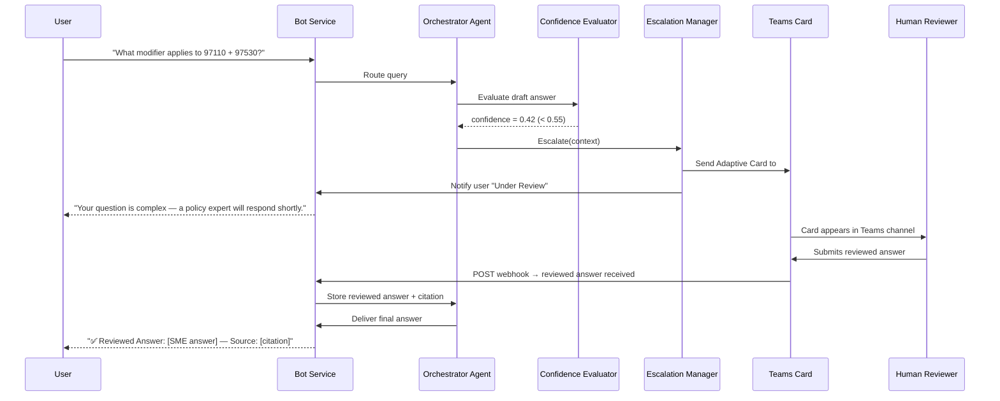

# Human-in-the-Loop (HITL)
{: .no_toc }

## Table of Contents
{: .no_toc .text-delta }

1. TOC
{:toc}

---

## Overview

Human-in-the-Loop (HITL) is a core architectural principle of Policy Bot: **when the system cannot answer with sufficient confidence, it does not guess — it coordinates expert review**.

The Escalation Manager Agent orchestrates a structured workflow that:

1. Notifies the appropriate human reviewer queue.
2. Presents the reviewer with the bot's draft answer, sub-scores, and source citations.
3. Captures the reviewer's authoritative answer.
4. Delivers the reviewed answer to the user.
5. Logs the interaction for training data and audit purposes.

---

## Escalation Triggers

A HITL escalation is triggered when **any** of the following conditions is met:

| Trigger | Condition | Rationale |
|---|---|---|
| **Low confidence** | Composite score < 0.55 | Core escalation gate |
| **No sources found** | 0 documents retrieved | Nothing to ground the answer |
| **High-stakes topic** | Query classified as legal/compliance/benefits | Extra caution for consequential decisions |
| **Ambiguous scope** | Multiple conflicting policy versions detected | Requires human disambiguation |
| **User-requested escalation** | User types "connect me to an expert" | Explicit opt-in |
| **Agent tool failure** | Search service or LLM call fails | System error fallback |

---

## Escalation Manager Agent: Responsibilities

```python
class EscalationManagerAgent:
    """
    Triggered by Orchestrator when confidence < threshold.
    Manages the full lifecycle of an escalated query.
    """

    async def escalate(self, context: EscalationContext) -> None:
        # 1. Determine reviewer queue based on topic classification
        queue = self.route_to_queue(context.topic_classification)

        # 2. Create escalation record in Cosmos DB
        escalation_id = await self.create_escalation_record(context)

        # 3. Send Teams Adaptive Card to reviewer queue channel
        await self.send_teams_card(queue, escalation_id, context)

        # 4. Send email backup notification via Logic App
        await self.trigger_email_notification(queue.email_list, escalation_id, context)

        # 5. Notify user that their question is being reviewed
        await self.notify_user_pending(context.thread_id)
```

---

## Reviewer Queue Routing

Policy questions are classified by topic at the Orchestrator level. The Escalation Manager uses this classification to route to the correct SME queue:

| Topic Classification | Reviewer Queue | Teams Channel |
|---|---|---|
| HR / Benefits | HR Policy Team | `#hr-policy-review` |
| Compliance / Regulatory | Compliance Officers | `#compliance-review` |
| Fee Schedules | Billing Department | `#billing-policy-review` |
| Operations | Operations Manager | `#ops-policy-review` |
| Unknown / General | All-Policy Fallback | `#policy-escalations` |

---

## Teams Adaptive Card Design

The reviewer receives a structured **Teams Adaptive Card** containing:

```json
{
  "type": "AdaptiveCard",
  "version": "1.5",
  "body": [
    {
      "type": "TextBlock",
      "text": "🔴 Policy Bot — Review Required",
      "weight": "Bolder",
      "size": "Large",
      "color": "Attention"
    },
    {
      "type": "FactSet",
      "facts": [
        { "title": "Escalation ID", "value": "ESC-20250312-0047" },
        { "title": "Confidence Score", "value": "0.42 (Low)" },
        { "title": "Topic", "value": "Fee Schedule — Modifier Rules" },
        { "title": "User", "value": "Anonymous (Session #4821)" },
        { "title": "Submitted", "value": "2025-03-12 14:23 UTC" }
      ]
    },
    {
      "type": "TextBlock",
      "text": "**User Question:**",
      "weight": "Bolder"
    },
    {
      "type": "TextBlock",
      "text": "What modifier applies to procedure code 97110 when billed with 97530 on the same day?",
      "wrap": true
    },
    {
      "type": "TextBlock",
      "text": "**Bot's Draft Answer (unverified):**",
      "weight": "Bolder"
    },
    {
      "type": "TextBlock",
      "text": "Modifier 59 may apply when procedures are distinct and separately identifiable. However, fee schedule modifier rules vary by payer.",
      "wrap": true,
      "color": "Warning"
    },
    {
      "type": "TextBlock",
      "text": "**Sources Consulted:**",
      "weight": "Bolder"
    },
    {
      "type": "TextBlock",
      "text": "• AHCA Fee Schedule 2025 — Section 7.4\n• CMS Modifier Guidelines (web)\n• Internal Billing Manual v3.2",
      "wrap": true
    }
  ],
  "actions": [
    {
      "type": "Action.ShowCard",
      "title": "✅ Submit Reviewed Answer",
      "card": {
        "type": "AdaptiveCard",
        "body": [
          {
            "type": "Input.Text",
            "id": "reviewed_answer",
            "label": "Your authoritative answer:",
            "isMultiline": true,
            "placeholder": "Enter the correct policy answer here..."
          },
          {
            "type": "Input.Text",
            "id": "source_citation",
            "label": "Source citation (document, section, URL):",
            "placeholder": "e.g., AHCA Fee Schedule 2025, Section 7.4"
          },
          {
            "type": "Input.Toggle",
            "id": "add_to_training",
            "title": "Add this Q&A pair to the training dataset",
            "value": "true"
          }
        ],
        "actions": [
          {
            "type": "Action.Submit",
            "title": "Submit Answer",
            "data": {
              "action": "submit_reviewed_answer",
              "escalation_id": "ESC-20250312-0047"
            }
          }
        ]
      }
    },
    {
      "type": "Action.Submit",
      "title": "🔄 Reassign to Another Queue",
      "data": {
        "action": "reassign",
        "escalation_id": "ESC-20250312-0047"
      }
    },
    {
      "type": "Action.Submit",
      "title": "❌ Cannot Answer — Flag for Policy Update",
      "style": "destructive",
      "data": {
        "action": "flag_for_update",
        "escalation_id": "ESC-20250312-0047"
      }
    }
  ]
}
```

---

## Full HITL Workflow



---

## Email Notification (Logic App Backup)

An **Azure Logic App** provides email backup notification for reviewer teams that may not see the Teams card immediately:

```
Subject: [Policy Bot] Review Required — ESC-20250312-0047
Priority: High

A policy question requires your review.

Topic: Fee Schedule — Modifier Rules
Confidence Score: 0.42 (Low)
Submitted: 2025-03-12 14:23 UTC

User Question:
"What modifier applies to procedure code 97110 when billed with 97530 on the same day?"

Please review and respond via Teams: [LINK TO CARD]
SLA: 4 business hours

If not addressed within 4 hours, this escalation will be re-routed to the All-Policy Fallback queue.
```

---

## SLA Enforcement and Re-routing

```python
# Logic App / Azure Function timer trigger: runs every 30 minutes
async def check_escalation_slas():
    overdue = await cosmos.query(
        "SELECT * FROM escalations e WHERE e.status = 'pending' "
        "AND e.created_at < DateTimeAdd('hour', -4, GetCurrentDateTime())"
    )
    for escalation in overdue:
        await reassign_to_fallback_queue(escalation)
        await notify_escalation_manager(escalation)
```

| SLA Tier | Target Response Time | Action on Breach |
|---|---|---|
| High-stakes (legal/compliance) | 1 business hour | Immediate manager alert |
| Standard policy query | 4 business hours | Re-route to fallback queue |
| Fee schedule lookup | 2 business hours | Re-route to billing fallback |

---

## Audit and Training Data Collection

All HITL outcomes are captured in Cosmos DB and can be exported for:

1. **Audit trail** — Who reviewed what, when, and what answer they provided.
2. **Training data** — High-quality Q&A pairs from HITL outcomes are used to fine-tune the system or update the knowledge index.
3. **Threshold calibration** — Aggregate HITL patterns inform quarterly confidence threshold reviews.

```json
// Cosmos DB escalation document
{
  "id": "ESC-20250312-0047",
  "session_id": "4821",
  "question": "What modifier applies to 97110 + 97530?",
  "bot_draft_answer": "Modifier 59 may apply...",
  "confidence_scores": {
    "composite": 0.42,
    "faithfulness": 0.55,
    "relevance": 0.38,
    "completeness": 0.40
  },
  "reviewer_id": "jsmith@org.com",
  "reviewed_answer": "Modifier 59 applies per CMS Transmittal 2526. See AHCA Fee Schedule 2025 Section 7.4.",
  "source_citation": "AHCA Fee Schedule 2025, Section 7.4",
  "added_to_training": true,
  "resolved_at": "2025-03-12T16:45:00Z",
  "status": "resolved"
}
```
